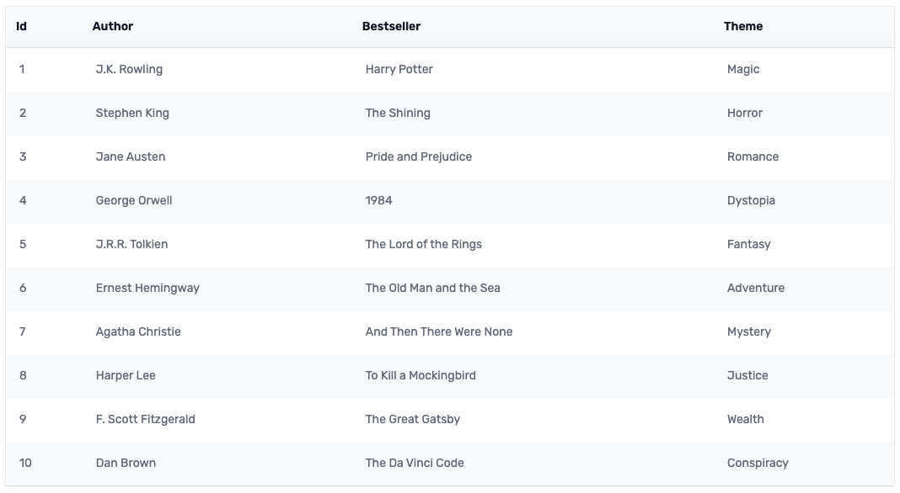
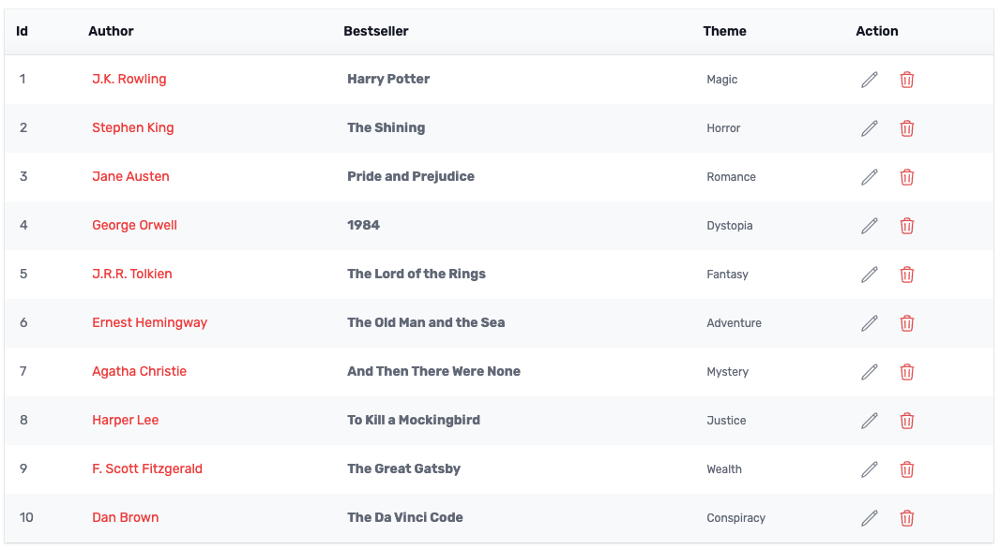
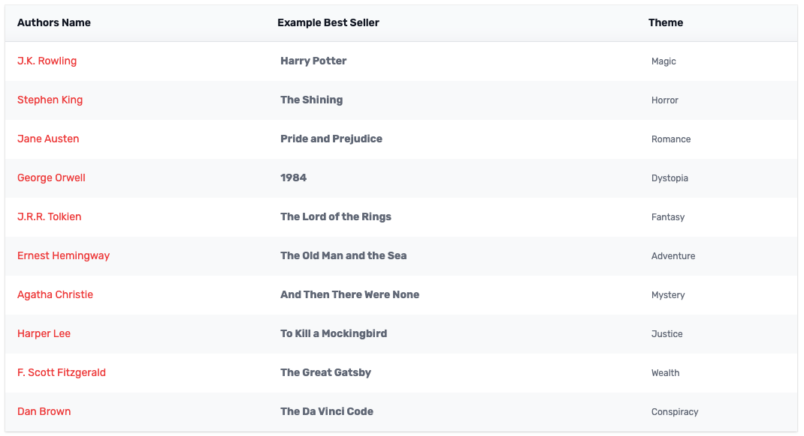
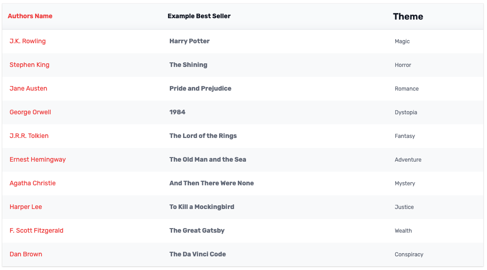
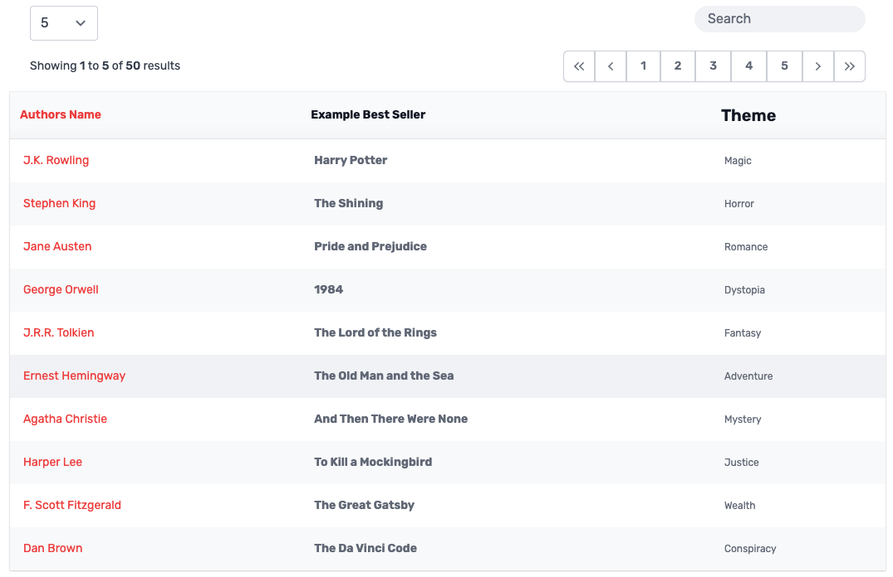

# Vue 3 Datatables

---

Set of simple datatable components for Vue 3.

## Installation

```shell
npm install @mythicaldev/md-vue3-datatables
```

## Quick Start

Bare bones and basic implementation. 

```vue
<template>
  <DataTable :rows="data" />
</template>

<script setup>
  // Import the main DataTable component
  import { DataTable } from 'md-vue3-datatables';

  // Give it some data!
  const data = [
    {
      id: 1,
      author: 'J.K. Rowling',
      bestSeller: 'Harry Potter',
      theme: 'Magic',
    },
    {
      id: 2,
      author: 'Stephen King',
      bestSeller: 'The Shining',
      theme: 'Horror',
    },
    ...
  ];
</script>
```


## Advanced Usage

There are a number of ways you can utilize the set of components. Here are a few ways beyond a basic implementation.

### Custom data rows

You can override the table body rows and include any other custom content, including other vue components if desired.
This is often useful for an action row.

```vue
<template>
  <DataTable :rows="data">
    <template #tbody="{ row }">
      <TBodyCell>{{ row.id }}</TBodyCell>
      <TBodyCell><span class="text-red-500"> {{ row.author }}</span></TBodyCell>
      <TBodyCell><span class="font-bold"> {{ row.bestSeller }}</span></TBodyCell>
      <TBodyCell><span class="text-xs"> {{ row.theme }}</span></TBodyCell>
      <TBodyCell>
        <div class="flex items-center">
          <ActionButton class="text-blue mr-5" @onAction="handleEdit(row.id)">
            <PencilIcon class="w-5 h-5" />
          </ActionButton>
          <ActionButton class="text-red-600" @onAction="handleDelete(row.id)">
            <TrashIcon class="w-5 h-5" />
          </ActionButton>
        </div>
      </TBodyCell>
    </template>
  </DataTable>
</template>

<script setup>
  // Import both the main DataTable component and the TBodyCell component
  import { DataTable, TBodyCell } from 'md-vue3-datatables';

  // Give it some data!
  const data = [
    {
      id: 1,
      author: 'J.K. Rowling',
      bestSeller: 'Harry Potter',
      theme: 'Magic',
    },
    {
      id: 2,
      author: 'Stephen King',
      bestSeller: 'The Shining',
      theme: 'Horror',
    },
    ...
  ];
</script>
```



### Custom headers/data rows

You are able to override the headers and give them custom labels. This method requires you to also override the
data cells.

```vue
<template>
  <DataTable :columns="columns" :rows="data">
    <template #tbody="{ row }">
      <TBodyCell><span class="text-red-500"> {{ row.author }}</span></TBodyCell>
      <TBodyCell><span class="font-bold"> {{ row.bestSeller }}</span></TBodyCell>
      <TBodyCell><span class="text-xs"> {{ row.theme }}</span></TBodyCell>
    </template>
  </DataTable>
</template>

<script setup>
  // Import both the main DataTable component and the TBodyCell component
  import { DataTable, TBodyCell } from 'md-vue3-datatables';

  // Custom Column array
  const columns = ['Authors Name', 'Example Best Seller', 'Theme'];
  
  // Give it some data!
  const data = [
    {
      id: 1,
      author: 'J.K. Rowling',
      bestSeller: 'Harry Potter',
      theme: 'Magic',
    },
    {
      id: 2,
      author: 'Stephen King',
      bestSeller: 'The Shining',
      theme: 'Horror',
    },
    ...
  ];
</script>
```


### Overriding both headers and data rows

You are able to override both the header content giving more control over what you add to the column 
header and data cells.

```vue
<template>
  <DataTable :rows="data">
    <template #thead>
      <THeadCell><span class="text-red-500">Authors Name</span></THeadCell>
      <THeadCell><span class="font-bold">Example Best Seller</span></THeadCell>
      <THeadCell><span class="text-xl">Theme</span></THeadCell>
    </template>
    <template #tbody="{ row }">
      <TBodyCell><span class="text-red-500"> {{ row.author }}</span></TBodyCell>
      <TBodyCell><span class="font-bold"> {{ row.bestSeller }}</span></TBodyCell>
      <TBodyCell><span class="text-xs"> {{ row.theme }}</span></TBodyCell>
    </template>
  </DataTable>
</template>

<script setup>
  // Import the main DataTable, THeadCell, and TBodyCell components
  import { DataTable, THeadCell, TBodyCell } from 'md-vue3-datatables';

  // Give it some data!
  const data = [
    {
      id: 1,
      author: 'J.K. Rowling',
      bestSeller: 'Harry Potter',
      theme: 'Magic',
    },
    {
      id: 2,
      author: 'Stephen King',
      bestSeller: 'The Shining',
      theme: 'Horror',
    },
    ...
  ];
</script>
```


### Full example

You can also add pagination and filtering.

```vue
<tempalte>
  <DataTable :rows="data" :pagination="pagination" :showFilter="true" :showPageSize="true">
    <template #thead>
      <THeadCell><span class="text-red-500">Authors Name</span></THeadCell>
      <THeadCell><span class="font-bold">Example Best Seller</span></THeadCell>
      <THeadCell><span class="text-xl">Theme</span></THeadCell>
    </template>
    <template #tbody="{ row }">
      <TBodyCell><span class="text-red-500"> {{ row.author }}</span></TBodyCell>
      <TBodyCell><span class="font-bold"> {{ row.bestSeller }}</span></TBodyCell>
      <TBodyCell><span class="text-xs"> {{ row.theme }}</span></TBodyCell>
    </template>
  </DataTable>
</tempalte>

<script setup>
  // Import the main DataTable, THeadCell, and TBodyCell components
  import { DataTable, THeadCell, TBodyCell } from 'md-vue3-datatables';

  // Pagination Data
  const pagination = {
      total: 50,
      perPage: 5,
      page: 1,
      search: '',
      sort: '',
  };
  
  // Give it some data!
  const data = [
    {
      id: 1,
      author: 'J.K. Rowling',
      bestSeller: 'Harry Potter',
      theme: 'Magic',
    },
    {
      id: 2,
      author: 'Stephen King',
      bestSeller: 'The Shining',
      theme: 'Horror',
    },
    ...
  ];
</script>
```


## Events

### loadData

This event is fired whenever the internal data query is updated, for example when a new per page number is selected,
a new page is selected, or a search parameter is entered.

You can use this event to load data from an external API.

```vue
<template>
  <DataTable :rows="state.data" :pagination="state.pagination" @loadData="loadData" />
</template>

<script setup>
  import { reactive } from 'vue';
  // Import the main DataTable component
  import { DataTable } from 'md-vue3-datatables';

  const state = reactive({
    data: [],
    params: {
      limit: 5,
      page: 1,
      search: '',
    },
    pagination: {
      total: 0,
      perPage: 5,
      page: 1,
      search: '',
      sort: '',
    },
  });

  const loadData = async () => {
    state.params.page = query.page;
    state.params.limit = query.per_page;
    state.pagination.perPage = query.per_page;
    state.params.search = query.search;
    
    state.data = await MyService.getData(state.params);
  }
</script>
```
## Props

| Prop             | Type    | Default                      | Required | Description                                                                                 |
|------------------|---------|------------------------------|----------|---------------------------------------------------------------------------------------------|
| showFilter       | Boolean | false                        | false | Display/Hide the search filter                                                              |
| showPageSize     | Boolean | false                        | false | Display/Hide the page size drop down                                                        |
| rows             | Array   | null                         | true | The data to display. This is the only reauired field                                        |
| columns          | Array   | null                         | false | Custom column names. If not supplied will use the key for the data row                      |
| pagination       | Object  | null                         | false | Pagination object. Should contain the following keys: total, perPage, page, search and sort |
 | perPageOptions   | Object  | [5, 10, 15, 25, 50, 75, 100] | false | Options for the per page dropdown                                                           |
 | topPagination    | Boolean | true                         | false | Display/Hide the top pagination                                                             |
| bottomPagination | Boolean | false                        | false | Display/Hide the bottom pagination                                                          |

## License

[MIT](https://opensource.org/licenses/MIT)
